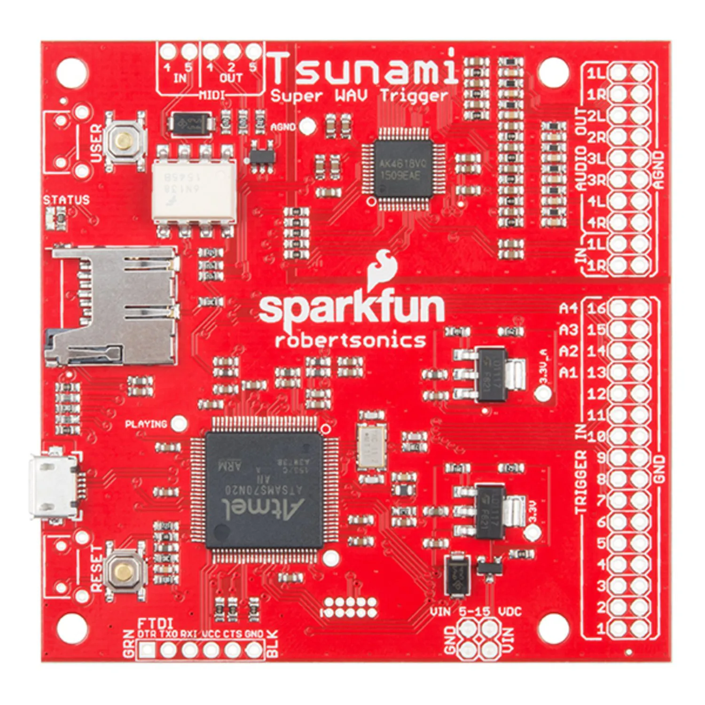

# floor-switches

## Software to manage the floor switches for my performance with City of London Sinfonia on 1st March 2023

Links a Teensy 3.2 to a Mk1 Robertsonics Tsunami Super Wav Trigger usine serial for the audio. The library needs to be modified to use serial 2 as we are reserving serial 1 to communicate with other arduinos.

A CD74HC4067 analog multiplexer is being used to handle the 16 switches. Each input is pulled down with a 4.7k resistor. A seperate 3v supply is used to allow for very long cable runs on the switches.

